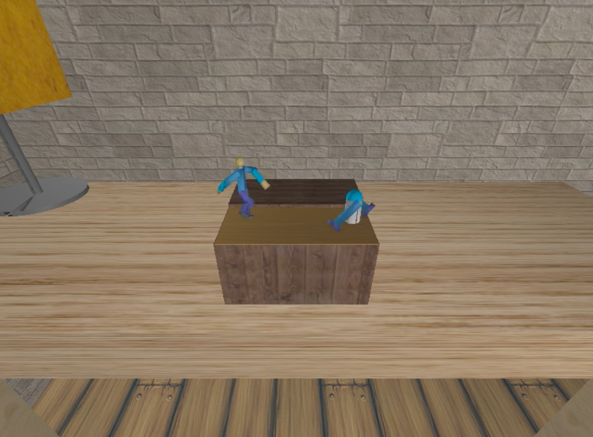

# CS 475/675 - Computer Graphics

## Indian Institute of Technology Bombay

This repository contains the solutions for all the assignments for the CS 675 course taken in Fall 2018.

**DISCLAIMER**: Please do NOT plagiarize from this work.

## Problem Statements and Reports

[PS1 - mydraw: Rasterization based interactive drawing](https://www.cse.iitb.ac.in/~paragc/teaching/2018/cs475/assignments/A1/A1.shtml)

[Report 1]()

[PS2 - The Music Box: Modelling.](https://www.cse.iitb.ac.in/~paragc/teaching/2018/cs475/assignments/A2/A2.shtml)

[Report 2]()

[PS3 - The Music Box: Rendering and Animation.](https://www.cse.iitb.ac.in/~paragc/teaching/2018/cs475/assignments/A3/A3.shtml)

[Report 3]()

## Final Project Video

## Team

[Nihal Singh](https://nihal111.github.io/)

[Arunabh Ghosh](https://arunabh98.github.io/)